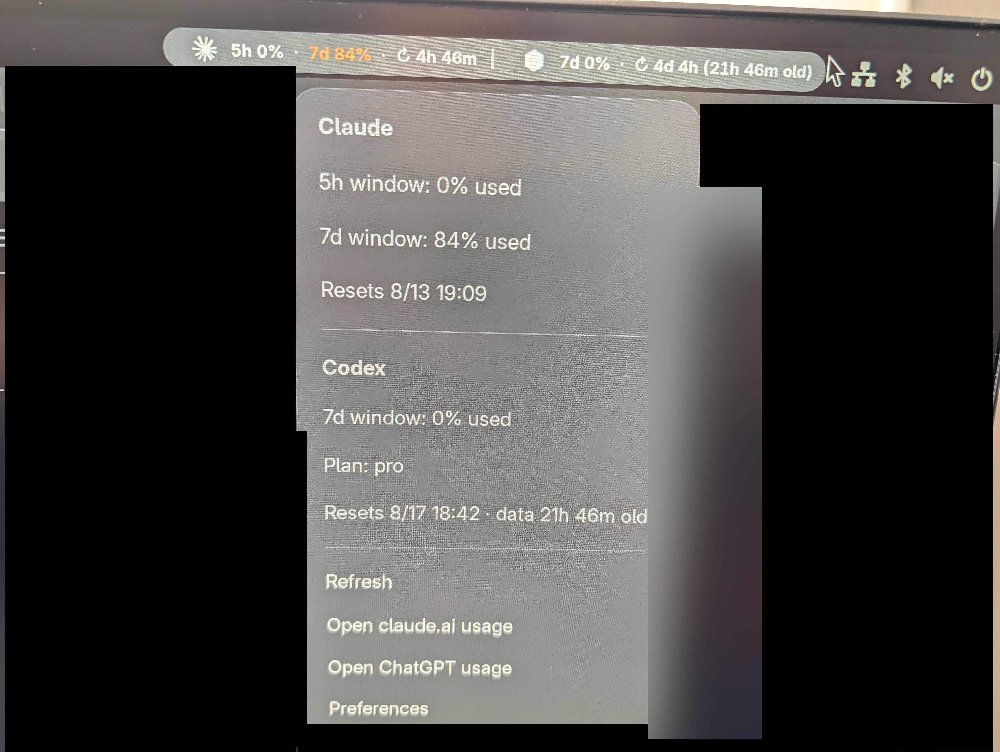

<p align="center">
  
</p>

<h1 align="center">AI Usage (Claude + Codex)</h1>

<p align="center">
  <strong>Monitor Claude and Codex usage limits right from the GNOME top bar</strong>
</p>

<p align="center">
  <a href="https://extensions.gnome.org/"></a>
  <a href="LICENSE"></a>
</p>

<p align="center">
  
</p>

---

## Features

- **Claude + Codex together** — enable either provider or show both
- **Live Codex limits** — uses Codex App Server's read-only multi-bucket usage view
- **Every named Codex model limit** — kept in the dropdown instead of ambiguous panel abbreviations
- **Earned reset credits** — available count in the panel, expiries in the dropdown; never consumes them
- **5-hour / 7-day windows** — used and remaining percentages plus automatic reset times
- **Claude model limits** — surfaces both Sonnet and Opus windows when reported
- **Color-coded labels** — white (normal) / yellow (>60%) / orange (>80%) / red (>90%)
- **Resilient refresh** — honors Claude 429 backoff and keeps the last good reading on transient failures
- **Legacy Codex fallback** — accepts only the canonical account-wide rollout bucket and marks old data stale
- **Auto-detect credentials** — reads your OAuth token from Claude Code automatically
- **Configurable** — provider toggles, refresh interval, panel position, manual Claude token override

## Installation

### From source

```bash
git clone https://github.com/stfnRO/gnome-shell-extension-claude-usage.git
cd gnome-shell-extension-claude-usage
bash install.sh
```

Then restart GNOME Shell (log out/in on Wayland, or `Alt+F2` → `r` on X11) and enable:

```bash
gnome-extensions enable claude-usage@tasta.space
```

## Provider setup

### Claude

If you have [Claude Code](https://docs.anthropic.com/en/docs/claude-code) installed and logged in, the extension reads your token from `~/.claude/.credentials.json` automatically. No setup needed.

Or configure Claude manually:

1. Open [claude.ai](https://claude.ai) and log in
2. DevTools (`F12`) → Application → Cookies → `claude.ai`
3. Copy the `sessionKey` cookie value (starts with `sk-ant-`)
4. Paste it in extension preferences → "Manual token"

```bash
gnome-extensions prefs claude-usage@tasta.space
```

### Codex

Install and sign in to Codex. The extension starts `codex app-server` only long
enough to call `account/rateLimits/read`; it does not consume usage or reset
credits. `AI_USAGE_CODEX_BIN` can override the binary and
`AI_USAGE_CODEX_TIMEOUT` controls its three-second default timeout.

If App Server is unavailable, the extension reads the newest canonical
account-wide limit from `~/.codex/sessions`. Model-specific rollout buckets are
ignored so they cannot replace the general account percentage.

## How it works

The extension refreshes both providers at a configurable interval (default: 3 minutes):

| Metric | Description |
| --- | --- |
| `five_hour` | Short-term rate limit (resets every 5 hours) |
| `seven_day` | Weekly rolling rate limit |
| `seven_day_sonnet` | Separate Sonnet model limit (shown if available) |
| `seven_day_opus` | Separate Opus model limit (shown if available) |
| `account/rateLimits/read` | Live Codex account, model, and reset-credit limits |

## Development

| Task | Command |
| --- | --- |
| Enable | `gnome-extensions enable claude-usage@tasta.space` |
| Disable | `gnome-extensions disable claude-usage@tasta.space` |
| Preferences | `gnome-extensions prefs claude-usage@tasta.space` |
| View logs | `journalctl --user -u org.gnome.Shell@user.service -f \| grep "AI Usage"` |
| Compile schemas | `glib-compile-schemas --strict schemas/` |

## Disclaimer

Not affiliated with or endorsed by Anthropic or OpenAI. No warranty expressed or implied.

## License

[MIT](LICENSE)
